# StudyCards ユーザーマニュアル

**バージョン 1.1**  
**対応プラットフォーム:** iOS 18+ • macOS 16+

---

## 目次

1. [はじめに](#1-はじめに)
2. [基本的な使い方](#2-基本的な使い方)
3. [整理と並べ替え](#3-整理と並べ替え)
4. [学習モード](#4-学習モード)
5. [インポートとエクスポート](#5-インポートとエクスポート)
6. [フラッシュカードの共有](#6-フラッシュカードの共有)
7. [設定](#7-設定)
8. [ヒント](#8-ヒント)

---

## 1. はじめに

**StudyCards** へようこそ — iOS と Mac 向けの強力でエレガントなフラッシュカードアプリです。LaTeX 数式、画像、シームレスなインポート・エクスポート機能を備えたフラッシュカードの作成、管理、学習が可能です。

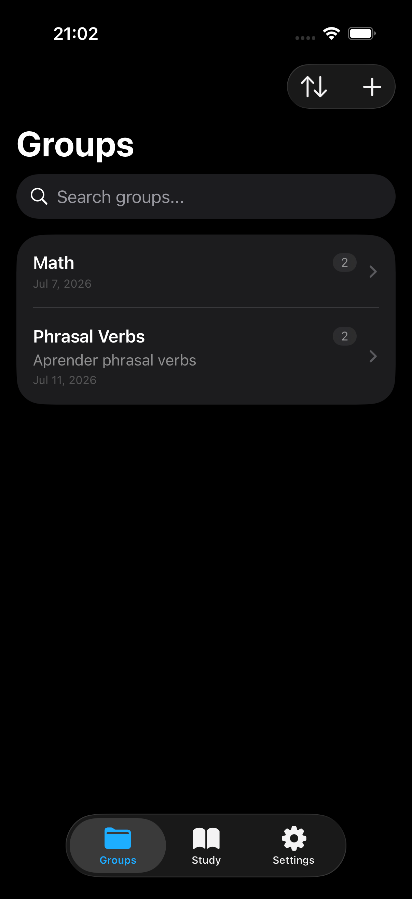
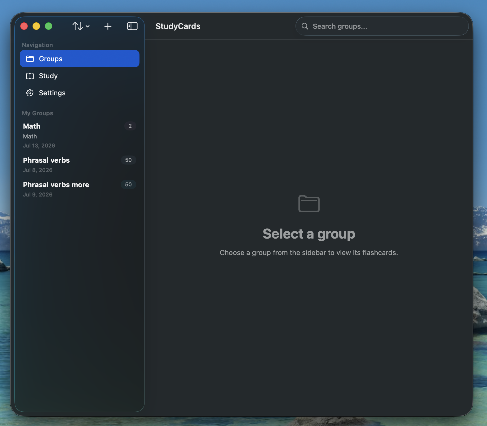

**主な機能:**

- **フラッシュカードグループ:** トピックや教科ごとにカードを整理
- **完全なフラッシュカード:** テキスト、LaTeX 数式、画像に対応した表面と裏面
- **手動並べ替え:** ドラッグでグループ内のカード順を変更
- **グループ編集:** コンテキストメニュー（長押し）でグループを編集・削除
- **並べ替えと検索:** 名前、日付、カード数でグループを並べ替え・検索
- **学習モード:** 簡単/迷った/分からなかった で知識を評価
- **インポートとエクスポート:** CSV または JSON ファイル（Base64 エンコード画像付き）でカードを転送
- **共有:** メール、WhatsApp、AirDrop などでフラッシュカードを送信
- **カスタマイズ設定:** 外観、言語、学習順序の変更可能
- **アダプティブデザイン:** iPhone、iPad、Mac に自動適応

### 必要な環境

- iOS 18.0 以上 / macOS 16.0 以上
- LaTeX 数式のレンダリング（MathJax）にのみインターネット接続が必要

---

## 2. 基本的な使い方

### 2.1 グループの作成

グループはフラッシュカードをトピック、教科、カテゴリ別に整理するのに役立ちます。

**手順:**

1. StudyCards を開きます。
2. メイン画面で **+** ボタンをタップします。
3. グループ名を入力します（例: 「英単語」「数学の公式」）。
4. オプションで、グループの内容を識別するための説明を追加します。
5. **保存** をタップして確認します。

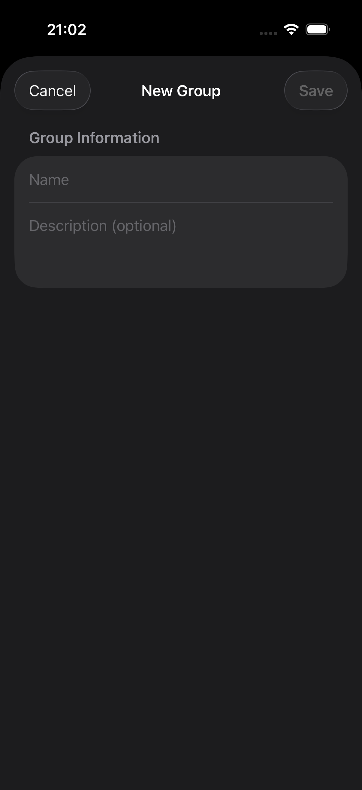

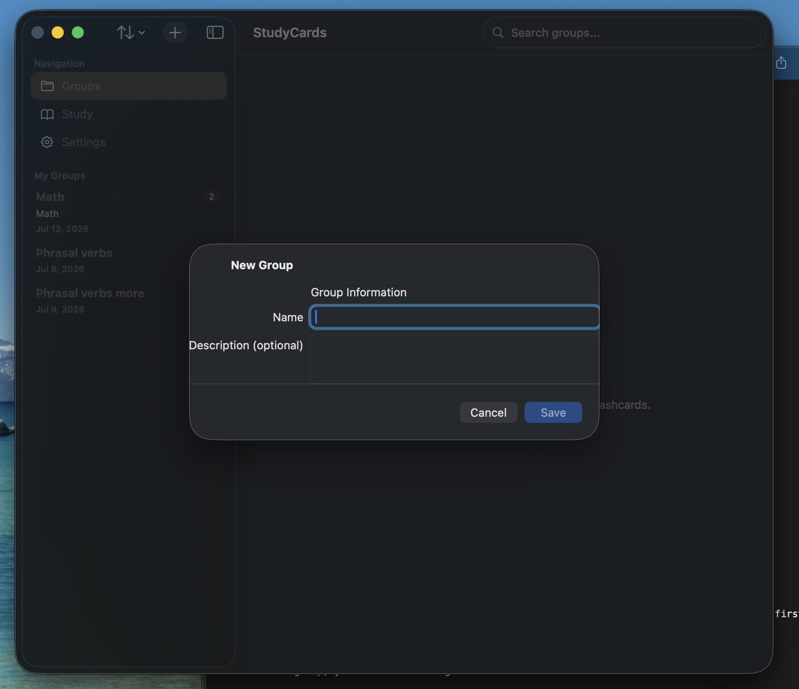

**グループの整理のコツ:**

- 識別しやすい説明的な名前を使いましょう。
- 教科、章、難易度レベルごとにグループを作成すると効果的です。
- 必要な数のグループを作成できます。

### 2.2 グループの編集と削除

グループを一覧から直接編集・削除できます。

**iOS の場合:**

1. グループ名を長押ししてコンテキストメニューを表示します。
2. **編集** を選択して名前や説明を変更します。
3. **削除** を選択してグループとそのすべてのフラッシュカードを削除します。

**macOS の場合:**

1. グループ名を右クリックします。
2. **編集** または **削除** を選択します。

> **警告:** グループを削除すると、そのすべてのフラッシュカードが完全に削除されます。バックアップが必要な場合は、事前にエクスポートしてください。

### 2.3 フラッシュカードの作成

グループを開いたら、フラッシュカードを追加できます。

**手順:**

1. グループをタップして開きます。
2. **+** ボタンをタップします。
3. **表面** テキスト（質問やプロンプト）を入力します。
4. **裏面** テキスト（答えや説明）を入力します。
5. オプションで、**画像選択** をタップして画像を追加します。
6. オプションで、`$...$`（インライン）または `$$...$$`（ブロック）を使用して **LaTeX 数式** を追加します。
7. **保存** をタップします。

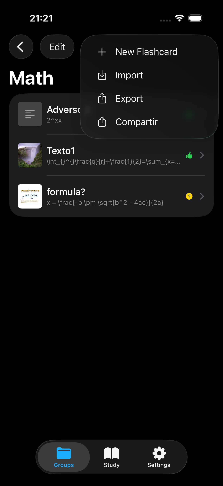

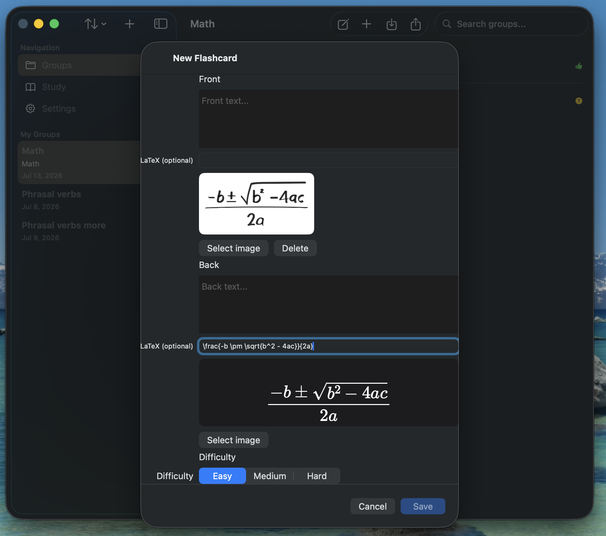

### 2.4 LaTeX 数式の追加

StudyCards は MathJax を使用した LaTeX レンダリングをサポートしており、数学や科学の表記法を扱えます。

| タイプ | 構文 | 例 |
|------|--------|---------|
| インライン | `$f(x) = x^2$` | 関数は $f(x) = x^2$ |
| ブロック | `$$\int_0^1 x^2 \, dx$$` | 別行の数式 |

**LaTeX の例:**

- **二次方程式:** `$x = \frac{-b \pm \sqrt{b^2 - 4ac}}{2a}$`
- **ピタゴラスの定理:** `$a^2 + b^2 = c^2$`
- **定積分:** `$$\int_a^b f(x)\,dx = F(b) - F(a)$$`

> **注意:** 数式はカードの保存時と学習セッション中に自動的にレンダリングされます。

### 2.5 画像の追加

フラッシュカードに画像を添付して、視覚的な学習が可能です。

**手順:**

1. フラッシュカードを作成または編集する际、**画像選択** をタップします。
2. 新しい写真を撮るか、ライブラリから選択します。
3. 画像がフラッシュカードに添付されます。

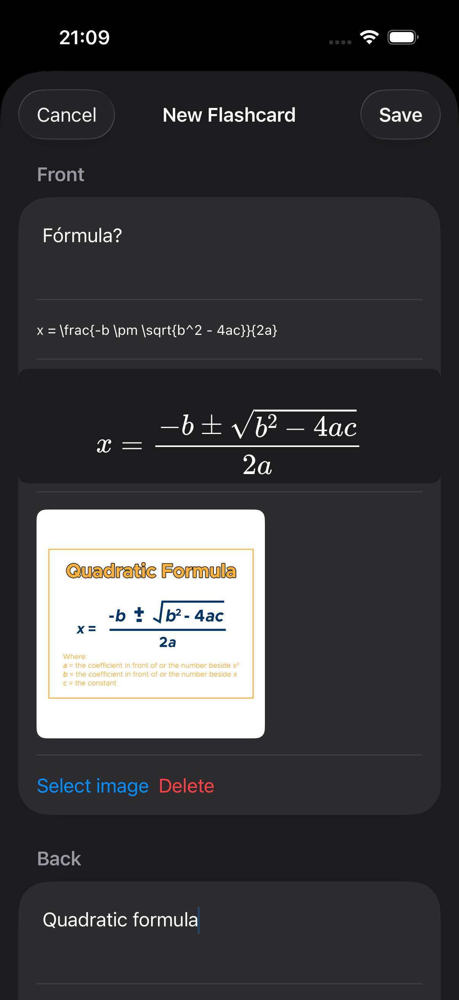

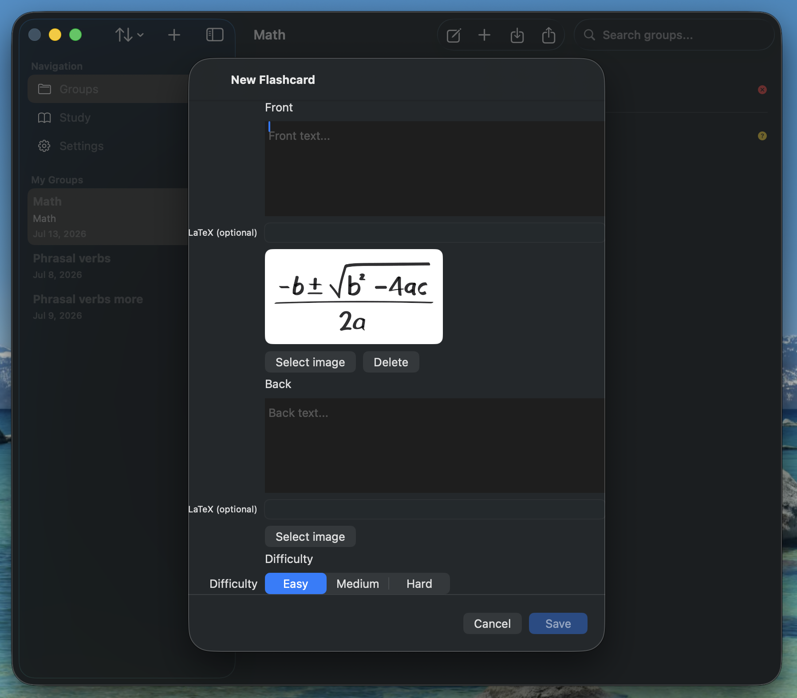

> **注意:** 画像はストレージを最適化するために、最大 1024 ピクセルに自動リサイズされます。JSON でエクスポートする際、画像は Base64 形式で含まれます。

### 2.6 フラッシュカードの削除

左にスワイプしてフラッシュカードを削除できます。

**手順:**

1. フラッシュカード一覧で、カードを左にスワイプします。
2. 赤い **削除** ボタンが表示されます。
3. **削除** をタップして確認します。

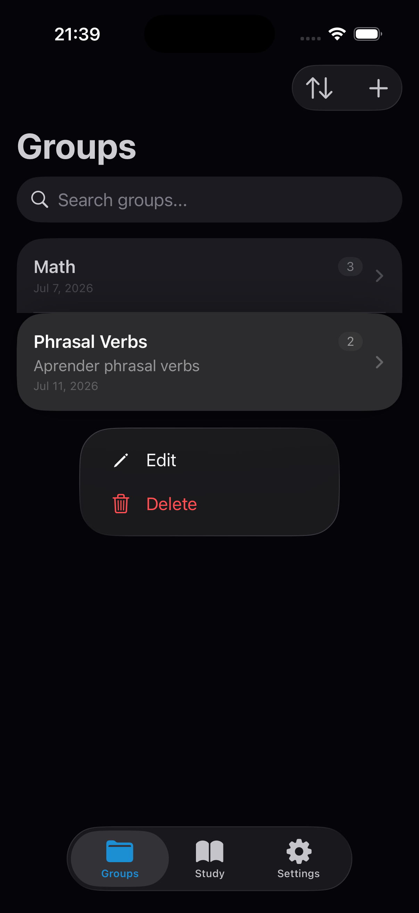

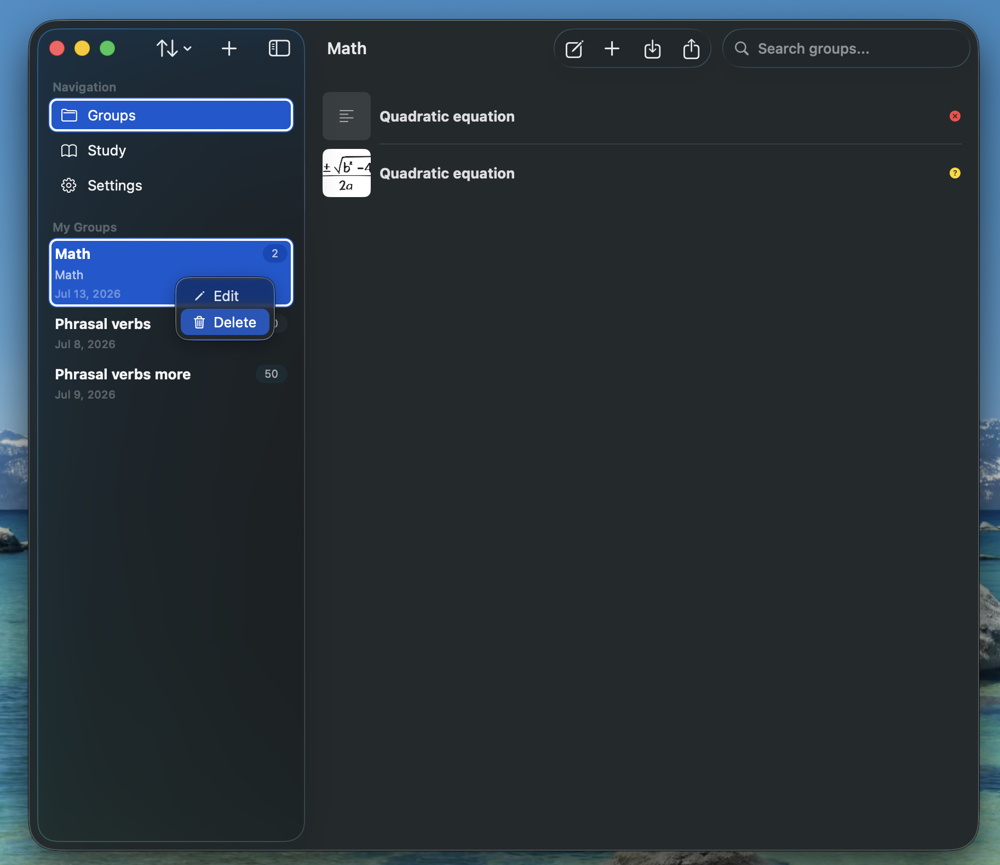

> **警告:** 削除は取り消せません。バックアップがない場合は、削除前にカードをエクスポートしてください。

---

## 3. 整理と並べ替え

### 3.1 フラッシュカードの手動並べ替え

グループ内のフラッシュカードの順序をドラッグで変更できます。

**iOS の場合:**

1. 並べ替えたいフラッシュカードのグループを開きます。
2. ツールバー（左上）の **編集** をタップします。
3. 各フラッシュカードの横にドラッグハンドル ⟟ が表示されます。
4. フラッシュカードを目的の位置にドラッグします。
5. **完了** をタップして新しい順序を保存します。

**macOS の場合:**

1. 並べ替えたいフラッシュカードのグループを開きます。
2. ツールバーの **並べ替え** ボタン（↕ アイコン）をタップします。
3. フラッシュカードを目的の位置にドラッグします。
4. **完了** をタップして並べ替えモードを終了します。

> **注意:** 手動の順序はフラッシュカードのエクスポートとインポート時に保持されます。

### 3.2 グループの並べ替え

グループ一覧を異なる基準で並べ替えることができます。

**手順:**

1. ツールバーの並べ替えボタン（↕ アイコン）をタップします。
2. 以下の並べ替え基準から選択します:

| 基準 | 説明 |
|-----------|-------------|
| **名前 A-Z** | アルファベットの昇順 |
| **名前 Z-A** | アルファベットの降順 |
| **最新** | 最近作成されたグループが先 |
| **古い順** | 最も古いグループが先 |
| **フラッシュカード数** | カード数の多いグループが先 |

> **注意:** 並べ替えは **グループ** と **学習** の両セクションに適用されます。

### 3.3 グループの検索

**iOS の場合:**

1. グループ一覧を下にスワイプして検索バーを表示します。
2. 検索するグループ名を入力します。

**macOS の場合:**

1. サイドバーの上の検索バーを使用します。
2. 検索するグループ名を入力します。

---

## 4. 学習モード

学習モードは StudyCards の核心です。フラッシュカードを対話的に復習し、知識レベルを評価できます。

### 4.1 学習セッションの開始

**手順:**

1. ナビゲーションバーで **学習** タブを選択します。
2. 学習したいグループを検索して選択します。
3. 最初のフラッシュカードが画面に表示されます。

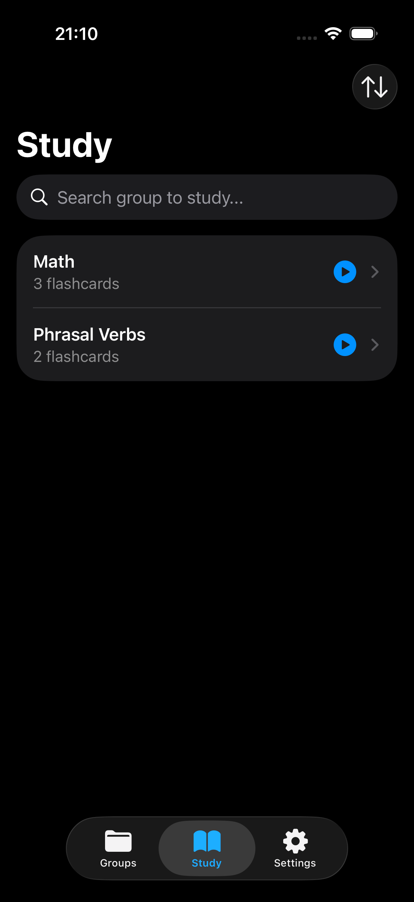

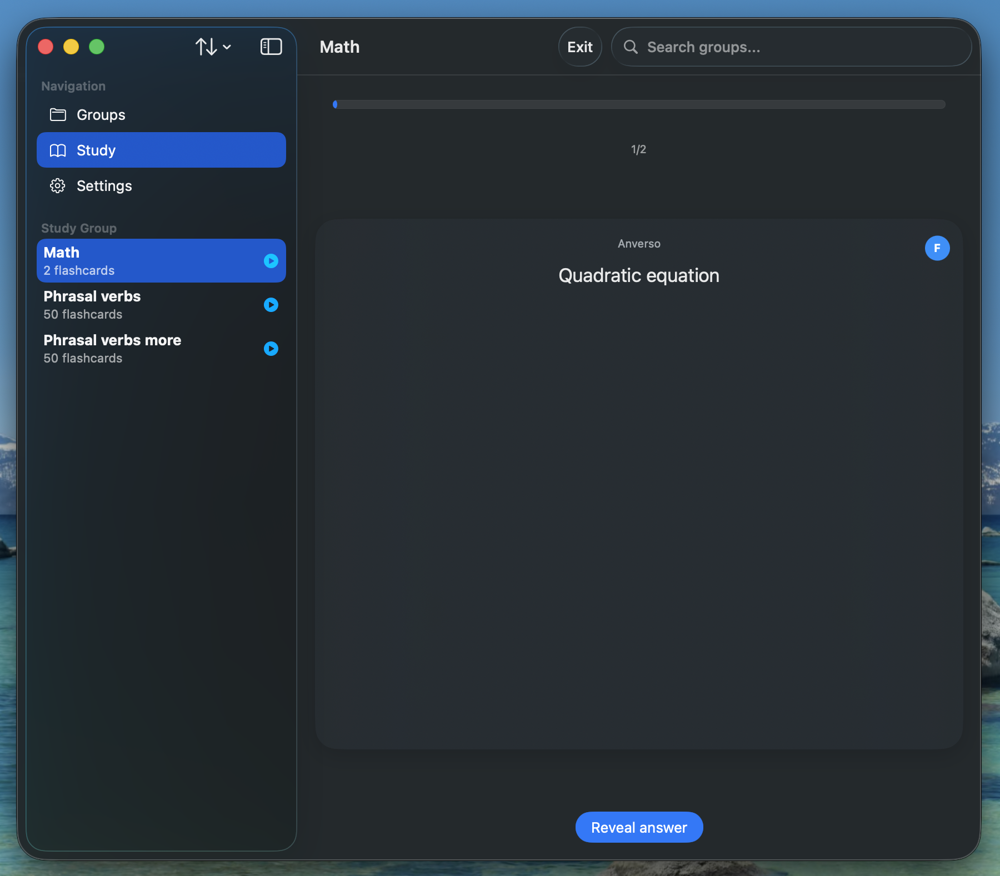

### 4.2 カード間のナビゲーション

学習セッション中:

1. カードの **表面**（質問）を読みます。
2. 答えを考えます。
3. **答えを表示** をタップするか、カードをタップして **裏面**（答え）を表示します。
4. 以下の 3 つの評価ボタンから知識を評価します:

| ボタン | 意味 | 説明 |
|--------|---------|-------------|
| 🟢 **簡単** | よく知っていた | カードは習得済みとしてマークされます。表示頻度が下がります。 |
| 🟡 **迷った** | 困难に思い出した | カードはもう少し後に再表示されます。 |
| 🔴 **分からなかった** | 答えられなかった | カードは学習するまで繰り返し表示されます。 |

**キーボードショートカット（macOS）:**

| キー | アクション |
|-----|--------|
| **Space** | カードを裏返す |
| **1** | 簡単と評価 |
| **2** | 迷ったと評価 |
| **3** | 分からなかったと評価 |

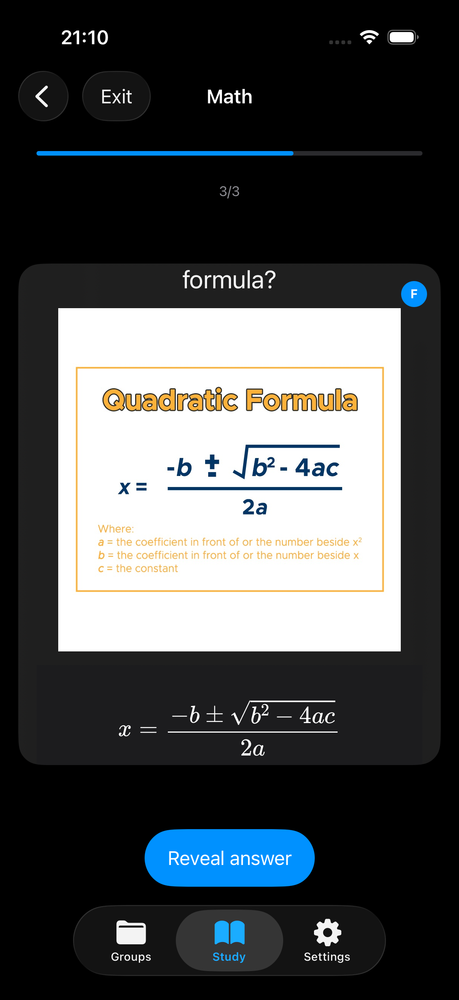

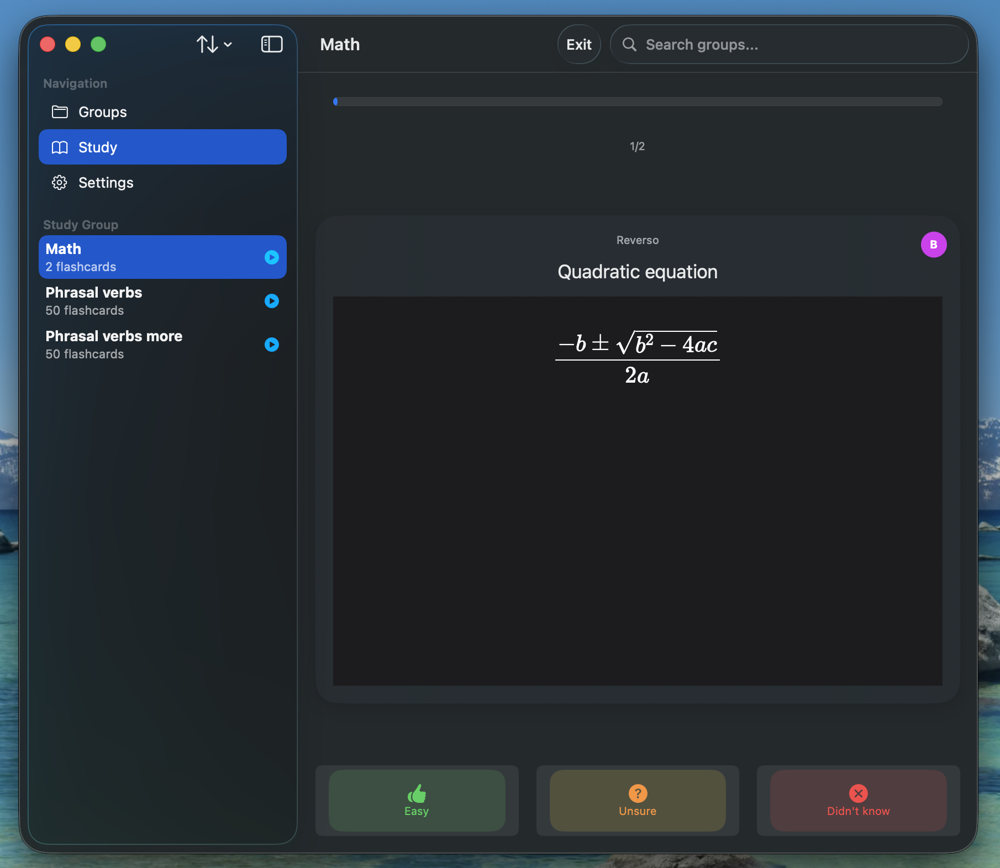

### 4.3 学習セッションの完了

グループ内のすべてのカードを復習し終わると:

1. 完了サマリーが表示されます。
2. *簡単*、*迷った*、*分からなかった* の各評価数が表示されます。
3. **もう一度学習** をタップして繰り返すか、**グループに戻る** で終了します。

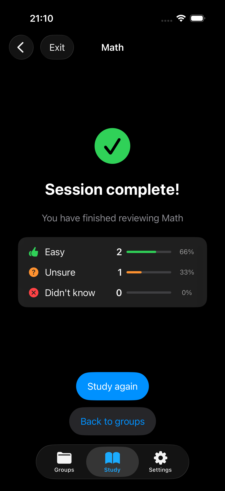

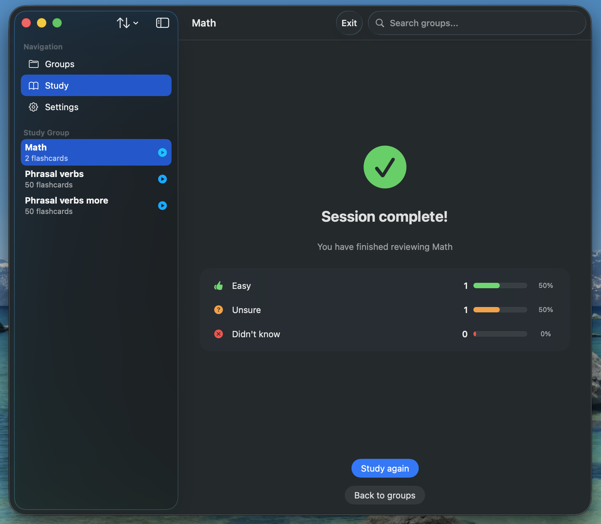

---

## 5. インポートとエクスポート

StudyCards では、CSV と JSON ファイルを使用してデバイス間でフラッシュカードを転送したり、バックアップを作成したりできます。

### 5.1 フラッシュカードのエクスポート

**手順:**

1. エクスポートしたいグループを開きます。
2. アクションメニューを開き、**エクスポート** を選択します。
3. エクスポート形式を選択します:
   - **CSV:** スプレッドシート形式。Excel や Numbers などで開くのに適しています。画像は含まれません。
   - **JSON:** 完全な形式。テキスト、LaTeX 数式、Base64 エンコードされた画像を含みます。
4. ファイルの保存先を選択します（ファイル、iCloud Drive など）。

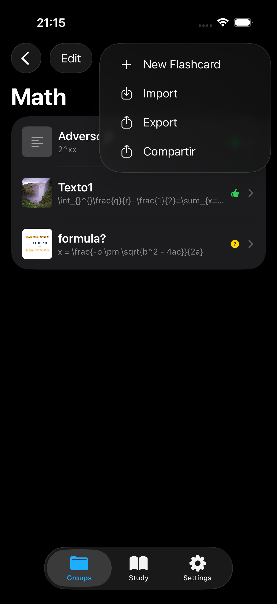

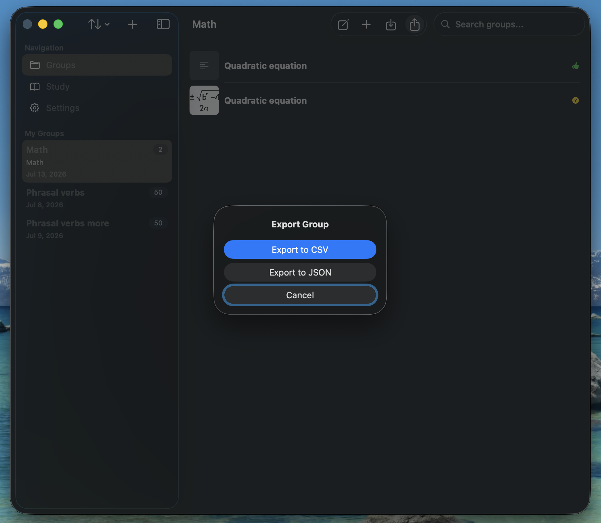

### 5.2 JSON ファイルの構造

エクスポートされた JSON ファイルは以下の構造を持ちます:

```json
{
  "groupName": "英単語",
  "version": "1.0",
  "createdAt": "2026-07-12T10:30:00Z",
  "cards": [
    {
      "front": "フランスの首都は？",
      "back": "パリです。",
      "frontLatex": null,
      "backLatex": null,
      "difficulty": 0,
      "frontImage": "base64_encoded_string...",
      "backImage": null
    }
  ]
}
```

### 5.3 CSV ファイルの構造

CSV ファイルは以下の列を使用します:

```csv
front,back,frontLatex,backLatex,difficulty,frontImage,backImage
"フランスの首都は？","パリです。","","0","",""
```

> **注意:** CSV 形式の画像は `frontImage` と `backImage` 列に Base64 文字列としてエクスポートされます。

### 5.4 フラッシュカードのインポート

**手順:**

1. グループのフラッシュカード一覧で、アクションメニューを開き **インポート** を選択します。
2. デバイスから CSV または JSON ファイルを選択します。
3. StudyCards がフラッシュカードを現在のグループにインポートします。

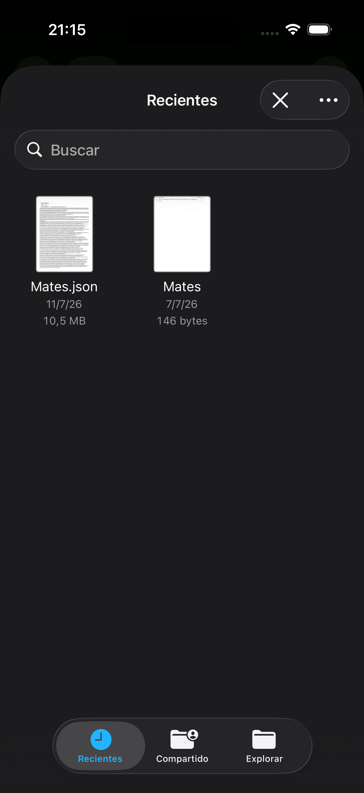

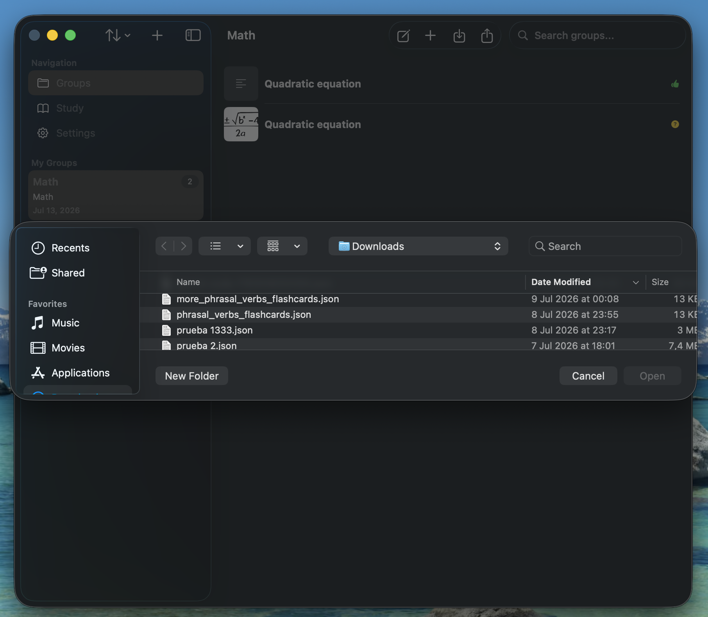

> **注意:** Base64 画像を含む JSON ファイルをインポートすると、画像はフラッシュカードに正しく表示されます。

### 5.5 よくあるインポートエラー

| エラー | 原因 | 対処法 |
|-------|-------|----------|
| *フォーマットが認識されない* | ファイルが有効な CSV または JSON でない | ファイルに正しい拡張子があるか、破損していないか確認してください |
| *空のファイル* | ファイルにカードが含まれていない | ファイルに少なくとも 1 行のデータがあるか確認してください |

---

## 6. フラッシュカードの共有

StudyCards では、フラッシュカードを他のユーザーと簡単に共有できます。

### 6.1 JSON としてグループを共有

**手順:**

1. 共有したいグループを開きます。
2. アクションメニューを開き **共有** を選択します。
3. システムの共有シートが開きます。
4. 送信先のアプリまたは方法を選択します:
   - **AirDrop** — 近くの Apple デバイスに送信
   - **メール** — JSON ファイルを添付として送信
   - **WhatsApp** — JSON ファイルをドキュメントとして送信
   - **メッセージ** — iMessage 経由で送信
   - **その他のアプリ** — ファイル添付を受け付けるすべてのアプリ

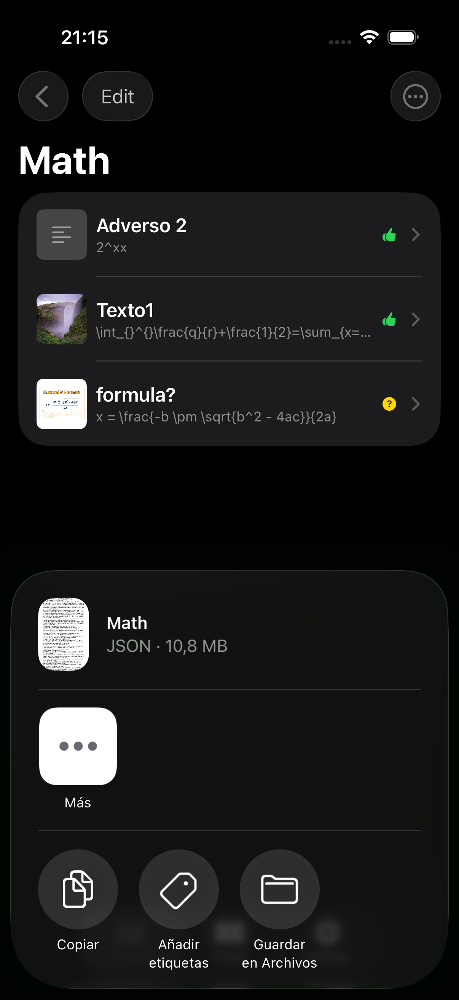

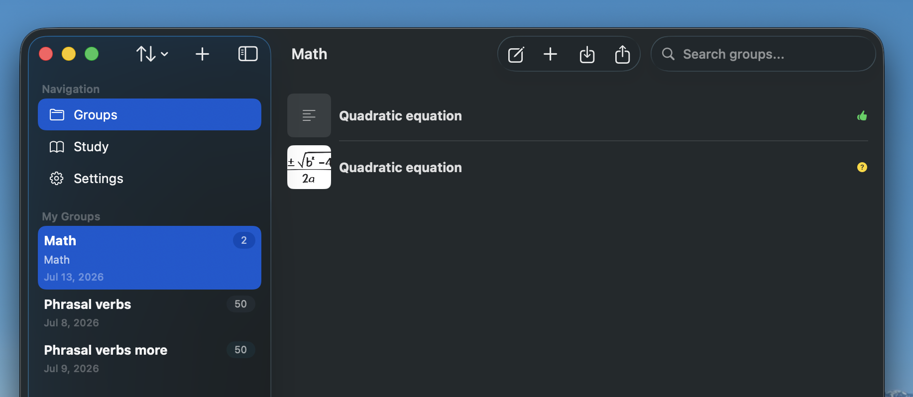

### 6.2 共有されたフラッシュカードの受信

誰かが StudyCards の JSON ファイルを送信してきた場合:

1. デバイスでファイルを開きます。
2. **StudyCards で開く** または **インポート** を選択します。
3. グループがコレクションに自動的に追加されます。

---

## 7. 設定

StudyCards をあなたの好みに合わせてカスタマイズしましょう。

### 7.1 外観

アプリのビジュアルテーマを制御します。

| オプション | 説明 |
|--------|-------------|
| **システム** | デバイスの外観設定（ライト/ダーク）に自動的に一致します。 |
| **ライト** | 常にライトモードを使用します。 |
| **ダーク** | 常にダークモードを使用します。 |

**手順:**

1. **設定** タブに移動します。
2. **外観** セクションで、3 つのオプションから選択します。
3. 変更は即座に適用されます。

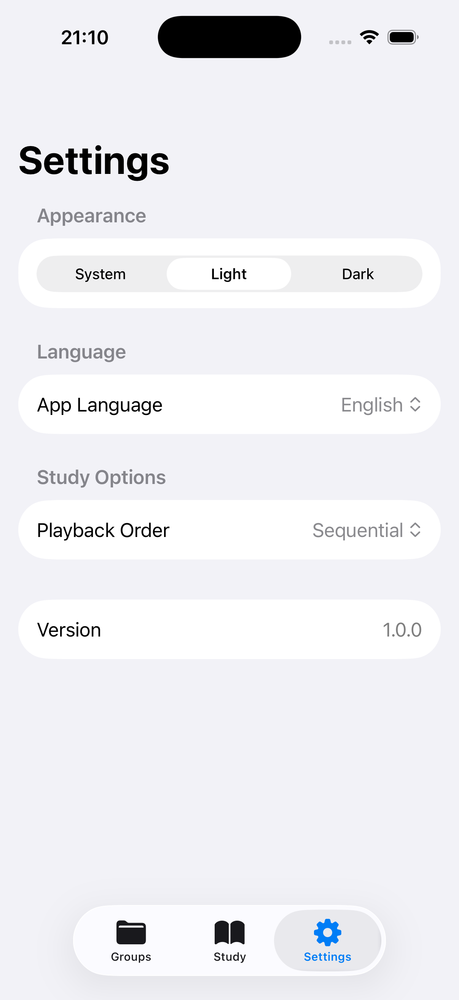

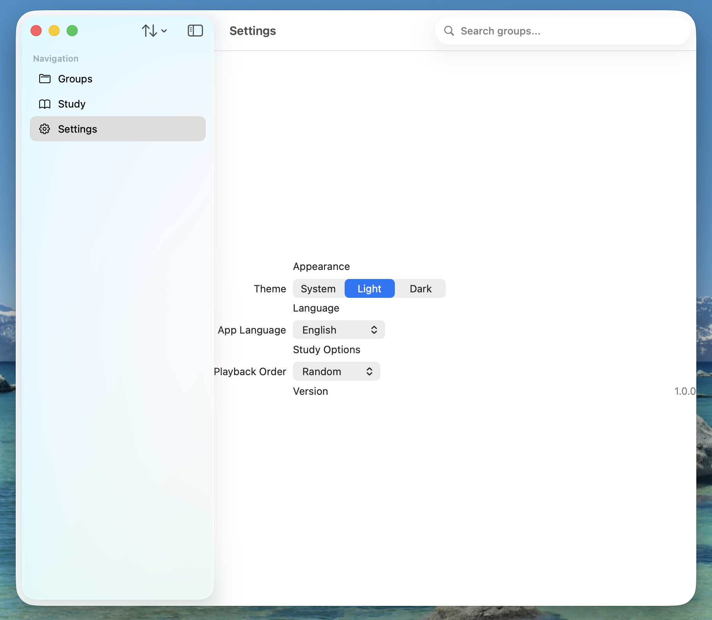

### 7.2 言語

StudyCards は 8 言語で利用できます。特定の言語を強制するか、システムのデフォルトを使用できます。

| 言語 | コード |
|----------|------|
| **システム** | デバイスの言語を自動選択 |
| Español | es |
| English | en |
| Português | pt |
| Français | fr |
| Deutsch | de |
| Italiano | it |
| 日本語 | ja |
| 中文 | zh |

**手順:**

1. **設定** タブに移動します。
2. **言語** セクションで、希望する言語を選択します。
3. 変更は再起動なしで即座に適用されます。

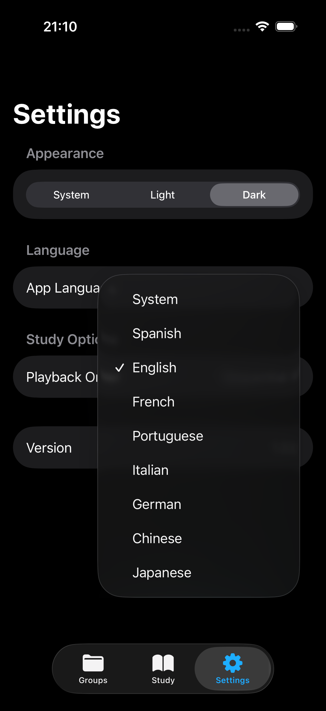

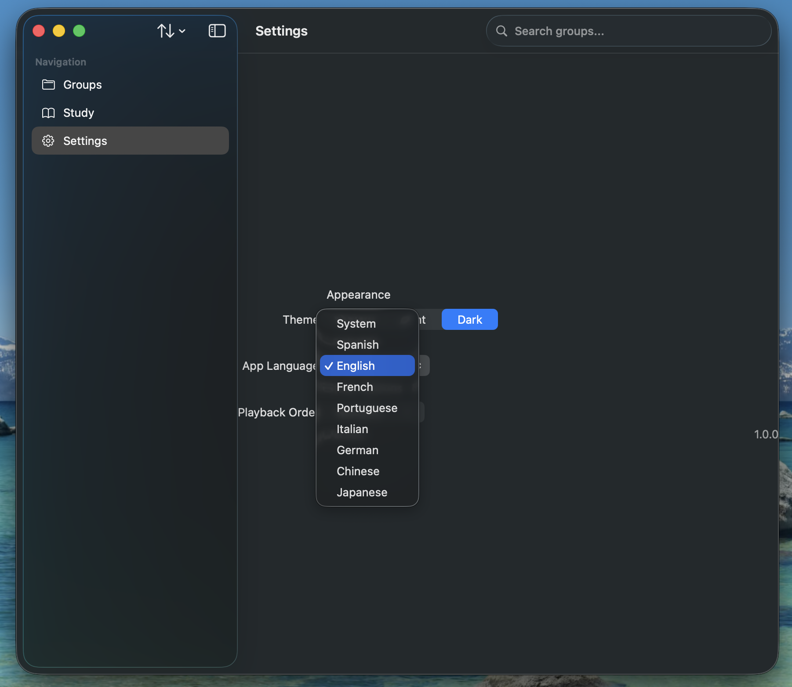

### 7.3 学習順序

学習モードでフラッシュカードが表示されるデフォルトの順序を設定します。

| オプション | 説明 |
|--------|-------------|
| **順番通り** | 作成順（または手動で並べ替えた順序）でカードを表示します。 |
| **ランダム** | 各セッションでカードをシャッフルします。 |

**手順:**

1. **設定** タブに移動します。
2. **学習順序** セクションで希望する設定を選択します。
3. 変更は以降のすべての学習セッションに適用されます。

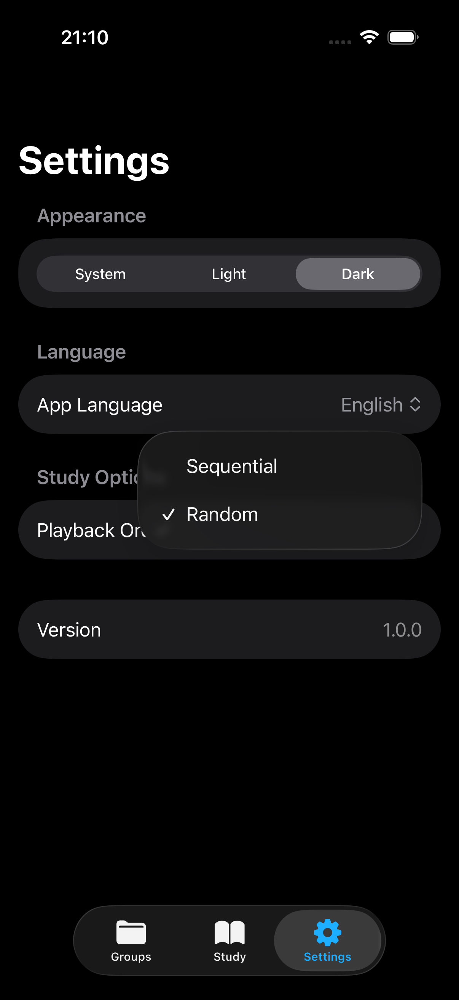

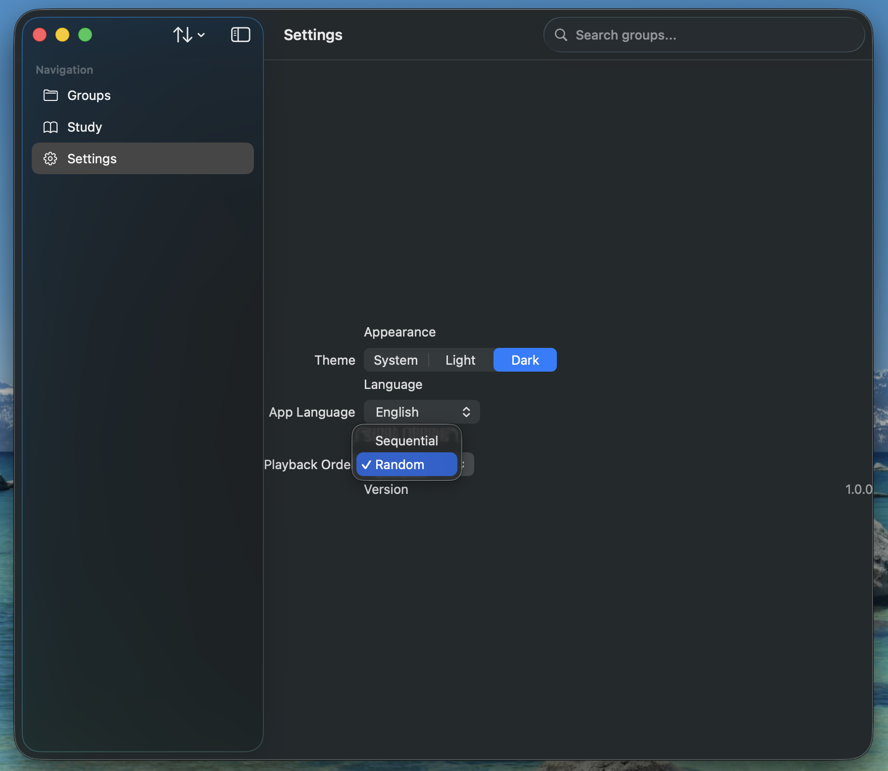

---

## 8. ヒント

### 整理

- **教科やトピックごとにグループを作成する。** 学習したい内容をすばやく見つけられます。
- **簡潔で分かりやすい名前を使う。** 画面で読むには長すぎるテキストは避けましょう。
- **フラッシュカードを手動で並べ替える。** 最も重要なカードを先頭に配置しましょう。
- **グループを定期的に見直す。** 習得したカードは削除し、進捗に合わせて新しいカードを追加しましょう。

### 学習

- **間隔を空けた繰り返しを活用する。** 同じカードを異なる日に学習して、長期記憶を定着させましょう。
- **難しいカードを無視しない。** カードを *分からなかった* と評価した場合は、そのグループをすぐに再学習しましょう。
- **学習モードを交互に使い分ける。** 順番通りとランダムを交互に使って、カードの位置を暗記するのを防ぎましょう。
- **macOS ではキーボードショートカットを使う。** （Space、1、2、3）でより速く学習できます。
- **短時間のセッションで学習する。** 10〜20 分で効果的な学習が可能です。

### コンテンツ

- **明確で簡潔な質問を書く。** 曖昧さを避けましょう。
- **1 カードに 1 つのアイデア。** 表面や裏面に情報を詰め込みすぎないでください。
- **画像を使う。** ダイアグラムや画像は文章の段落よりも効果的な場合があります。
- **数学や科学のコンテンツには LaTeX 数式を使う。** 正確でプロフェッショナルな見た目になります。

### バックアップ

- **グループを定期的にエクスポートする。** iCloud Drive やコンピュータにコピーを保存しましょう。
- **画像を保持したい場合は JSON 形式を使う。** CSV はテキストのみを保存します。
- **クラスメイトや同僚とフラッシュカードを共有して、学習を協力的に進めましょう。**

### パフォーマンス

- **学習中は他のアプリを閉じる。** StudyCards を中断なく実行できるようにしましょう。
- **アプリを最新の状態に保つ。** 新機能やバグ修正を適用できます。
- **LaTeX 数式がレンダリングされない場合は、インターネット接続を確認する。** MathJax は初回にリソースをダウンロードする必要があります。

---

## 法的情報

- **StudyCards** は独立して開発されたアプリケーションです。
- MathJax の使用は Apache 2.0 ライセンスに従います。
- データはデバイス上にのみ保存されます。StudyCards は個人情報を収集・共有しません。

---

*StudyCards ユーザーマニュアル — バージョン 1.1 — 2026年7月*
